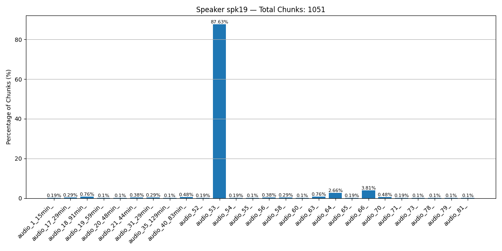
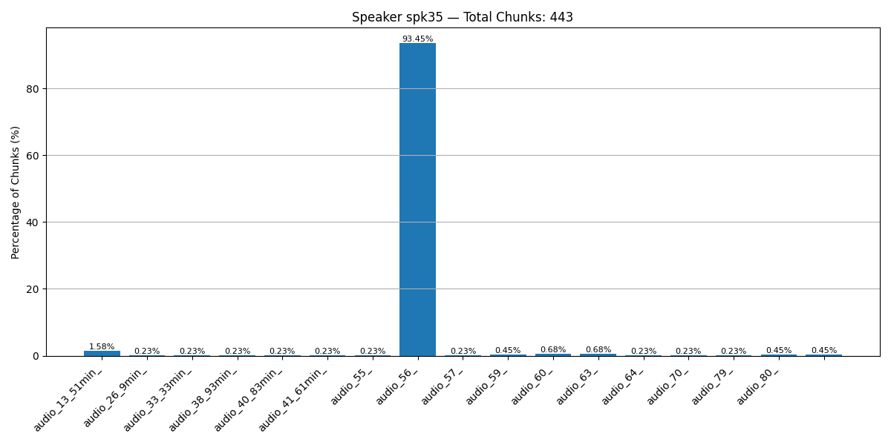

# Speaker Audio Chunk Distribution

This file shows the distribution of audio chunks across all speaker folders. Each entry lists how many chunks came from each audio file and its percentage.


```
________________________________________

### Speaker spk0
folder spk0
audio_33_33min_ =>    1 (  0.2%)
audio_59_       =>  419 ( 99.5%)
audio_77_       =>    1 (  0.2%)
________________________________________
```


```
________________________________________

### Speaker spk1
folder spk1
audio_41_61min_ =>    1 (  0.1%)
audio_52_       =>  771 ( 99.6%)
audio_66_       =>    1 (  0.1%)
audio_72_       =>    1 (  0.1%)
________________________________________
```


```
________________________________________

### Speaker spk2
folder spk2
audio_3_35min_   =>  408 ( 18.8%)
audio_16_81min_  =>    2 (  0.1%)
audio_24_6min_   =>   75 (  3.5%)
audio_27_13min_  =>    4 (  0.2%)
audio_28_58min_  =>    1 (  0.0%)
audio_34_13min_  =>    1 (  0.0%)
audio_35_129min_ =>   94 (  4.3%)
audio_36_42min_  =>  416 ( 19.2%)
audio_39_93min_  =>   14 (  0.6%)
audio_40_83min_  =>   13 (  0.6%)
audio_41_61min_  =>    1 (  0.0%)
audio_47_24min_  =>    1 (  0.0%)
audio_51_9min_   =>    1 (  0.0%)
audio_54_        =>    1 (  0.0%)
audio_55_        =>   93 (  4.3%)
audio_57_        =>    1 (  0.0%)
audio_59_        =>  232 ( 10.7%)
audio_61_        =>   40 (  1.8%)
audio_65_        =>    1 (  0.0%)
audio_72_        =>    1 (  0.0%)
audio_74_        =>  646 ( 29.8%)
audio_79_        =>    1 (  0.0%)
audio_80_        =>    5 (  0.2%)
                 =>  114 (  5.3%)
________________________________________
```


```
________________________________________

### Speaker spk3
folder spk3
audio_4_21min_  =>    1 (  0.1%)
audio_6_8min_   =>    6 (  0.9%)
audio_9_19min_  =>    1 (  0.1%)
audio_14_29min_ =>    5 (  0.7%)
audio_16_81min_ =>  376 ( 54.9%)
audio_22_92min_ =>    1 (  0.1%)
audio_26_9min_  =>    1 (  0.1%)
audio_27_13min_ =>    2 (  0.3%)
audio_31_29min_ =>    4 (  0.6%)
audio_34_13min_ =>    2 (  0.3%)
audio_37_85min_ =>    4 (  0.6%)
audio_41_61min_ =>  273 ( 39.9%)
audio_42_4min_  =>    1 (  0.1%)
audio_45_8min_  =>    1 (  0.1%)
audio_47_24min_ =>    3 (  0.4%)
audio_50_4min_  =>    2 (  0.3%)
audio_52_       =>    1 (  0.1%)
audio_58_       =>    1 (  0.1%)
________________________________________
```


```
________________________________________

### Speaker spk4
folder spk4
audio_59_ =>    1 (  0.2%)
audio_63_ =>    1 (  0.2%)
audio_66_ =>    1 (  0.2%)
audio_70_ =>  461 ( 99.4%)
________________________________________
```


```
________________________________________

### Speaker spk5
folder spk5
audio_31_29min_  =>    1 (  4.3%)
audio_35_129min_ =>    5 ( 21.7%)
audio_53_        =>    5 ( 21.7%)
audio_64_        =>    6 ( 26.1%)
audio_66_        =>    6 ( 26.1%)
________________________________________
```


```
________________________________________

### Speaker spk6
folder spk6
audio_11_24min_ =>    1 (  0.2%)
audio_18_91min_ =>  440 ( 94.8%)
audio_19_59min_ =>    3 (  0.6%)
audio_33_33min_ =>    1 (  0.2%)
audio_37_85min_ =>    1 (  0.2%)
audio_40_83min_ =>    1 (  0.2%)
audio_41_61min_ =>    1 (  0.2%)
audio_58_       =>    1 (  0.2%)
audio_59_       =>    1 (  0.2%)
audio_63_       =>    4 (  0.9%)
audio_64_       =>    1 (  0.2%)
audio_66_       =>    2 (  0.4%)
audio_71_       =>    1 (  0.2%)
audio_72_       =>    3 (  0.6%)
audio_74_       =>    1 (  0.2%)
audio_81_       =>    2 (  0.4%)
________________________________________
```


```
________________________________________

### Speaker spk7
folder spk7
audio_19_59min_ =>    1 (  1.4%)
audio_20_48min_ =>   69 ( 97.2%)
audio_67_       =>    1 (  1.4%)
________________________________________
```


```
________________________________________

### Speaker spk8
folder spk8
audio_22_92min_ =>  359 ( 97.6%)
audio_40_83min_ =>    1 (  0.3%)
audio_56_       =>    1 (  0.3%)
audio_57_       =>    1 (  0.3%)
audio_59_       =>    3 (  0.8%)
audio_66_       =>    1 (  0.3%)
audio_70_       =>    2 (  0.5%)
________________________________________
```


```
________________________________________

### Speaker spk9
folder spk9
audio_7_22min_  =>  207 ( 98.1%)
audio_9_19min_  =>    1 (  0.5%)
audio_40_83min_ =>    1 (  0.5%)
audio_43_21min_ =>    2 (  0.9%)
________________________________________
```


```
________________________________________

### Speaker spk10
folder spk10
audio_10_27min_ =>    1 (  0.5%)
audio_16_81min_ =>    1 (  0.5%)
audio_28_58min_ =>  205 ( 98.1%)
audio_41_61min_ =>    1 (  0.5%)
audio_62_       =>    1 (  0.5%)
________________________________________
```


```
________________________________________

### Speaker spk11
folder spk11
audio_22_92min_ =>    1 (  0.2%)
audio_38_93min_ =>    1 (  0.2%)
audio_57_       =>   11 (  2.0%)
audio_60_       =>    1 (  0.2%)
audio_66_       =>    1 (  0.2%)
audio_68_       =>  525 ( 97.0%)
audio_70_       =>    1 (  0.2%)
________________________________________
```


```
________________________________________

### Speaker spk12
folder spk12
audio_13_51min_ =>    1 (  0.1%)
audio_31_29min_ =>    1 (  0.1%)
audio_59_       =>    1 (  0.1%)
audio_62_       =>  726 ( 99.0%)
audio_67_       =>    1 (  0.1%)
                =>    3 (  0.4%)
________________________________________
```


```
________________________________________

### Speaker spk13
folder spk13
audio_12_17min_ =>  194 ( 98.0%)
audio_43_21min_ =>    1 (  0.5%)
audio_51_9min_  =>    3 (  1.5%)
________________________________________
```


```
________________________________________

### Speaker spk14
folder spk14
audio_10_27min_ =>   14 (100.0%)
________________________________________
```


```
________________________________________

### Speaker spk15
folder spk15
audio_8_25min_   =>    1 (  0.1%)
audio_10_27min_  =>    1 (  0.1%)
audio_19_59min_  =>    3 (  0.4%)
audio_31_29min_  =>    1 (  0.1%)
audio_35_129min_ =>   19 (  2.7%)
audio_53_        =>    7 (  1.0%)
audio_54_        =>  196 ( 27.5%)
audio_55_        =>  161 ( 22.6%)
audio_58_        =>  106 ( 14.9%)
audio_62_        =>    4 (  0.6%)
audio_64_        =>    4 (  0.6%)
audio_65_        =>  127 ( 17.8%)
audio_66_        =>    4 (  0.6%)
audio_72_        =>   79 ( 11.1%)
________________________________________
```


```
________________________________________

### Speaker spk16
folder spk16
audio_33_33min_ =>    2 (  0.4%)
audio_38_93min_ =>    1 (  0.2%)
audio_56_       =>    1 (  0.2%)
audio_57_       =>  315 ( 67.3%)
audio_59_       =>    1 (  0.2%)
audio_63_       =>    7 (  1.5%)
audio_66_       =>    1 (  0.2%)
audio_68_       =>  138 ( 29.5%)
audio_70_       =>    2 (  0.4%)
________________________________________
```


```
________________________________________

### Speaker spk17
folder spk17
audio_1_15min_  =>    1 (  0.1%)
audio_13_51min_ =>    3 (  0.3%)
audio_17_29min_ =>    3 (  0.3%)
audio_18_91min_ =>    2 (  0.2%)
audio_19_59min_ =>    1 (  0.1%)
audio_22_92min_ =>    1 (  0.1%)
audio_38_93min_ =>    1 (  0.1%)
audio_40_83min_ =>    7 (  0.7%)
audio_52_       =>    1 (  0.1%)
audio_53_       =>    1 (  0.1%)
audio_56_       =>    5 (  0.5%)
audio_57_       =>    1 (  0.1%)
audio_63_       =>    3 (  0.3%)
audio_64_       =>    4 (  0.4%)
audio_66_       =>  961 ( 93.1%)
audio_69_       =>    1 (  0.1%)
audio_70_       =>   33 (  3.2%)
audio_72_       =>    1 (  0.1%)
audio_79_       =>    1 (  0.1%)
audio_80_       =>    1 (  0.1%)
________________________________________
```


```
________________________________________

### Speaker spk18
folder spk18
audio_40_83min_ =>   12 (100.0%)
________________________________________
```


```
________________________________________

### Speaker spk19
folder spk19
audio_1_15min_   =>    2 (  0.2%)
audio_17_29min_  =>    3 (  0.3%)
audio_18_91min_  =>    8 (  0.8%)
audio_19_59min_  =>    1 (  0.1%)
audio_20_48min_  =>    1 (  0.1%)
audio_21_44min_  =>    4 (  0.4%)
audio_31_29min_  =>    3 (  0.3%)
audio_35_129min_ =>    1 (  0.1%)
audio_40_83min_  =>    5 (  0.5%)
audio_52_        =>    2 (  0.2%)
audio_53_        =>  921 ( 87.6%)
audio_54_        =>    2 (  0.2%)
audio_55_        =>    1 (  0.1%)
audio_56_        =>    4 (  0.4%)
audio_58_        =>    3 (  0.3%)
audio_60_        =>    1 (  0.1%)
audio_63_        =>    8 (  0.8%)
audio_64_        =>   28 (  2.7%)
audio_65_        =>    2 (  0.2%)
audio_66_        =>   40 (  3.8%)
audio_70_        =>    5 (  0.5%)
audio_71_        =>    2 (  0.2%)
audio_73_        =>    1 (  0.1%)
audio_78_        =>    1 (  0.1%)
audio_79_        =>    1 (  0.1%)
audio_81_        =>    1 (  0.1%)
________________________________________
```


```
________________________________________

### Speaker spk20
folder spk20
audio_22_92min_ =>  436 ( 99.3%)
audio_34_13min_ =>    1 (  0.2%)
audio_37_85min_ =>    1 (  0.2%)
audio_38_93min_ =>    1 (  0.2%)
________________________________________
```


```
________________________________________

### Speaker spk21
folder spk21
audio_2_39min_  =>  462 ( 98.7%)
audio_14_29min_ =>    1 (  0.2%)
audio_16_81min_ =>    1 (  0.2%)
audio_20_48min_ =>    1 (  0.2%)
audio_26_9min_  =>    1 (  0.2%)
audio_31_29min_ =>    1 (  0.2%)
audio_47_24min_ =>    1 (  0.2%)
________________________________________
```


```
________________________________________

### Speaker spk22
folder spk22
audio_10_27min_  =>    1 (  4.3%)
audio_13_51min_  =>    1 (  4.3%)
audio_19_59min_  =>    1 (  4.3%)
audio_35_129min_ =>    2 (  8.7%)
audio_53_        =>    3 ( 13.0%)
audio_54_        =>    4 ( 17.4%)
audio_64_        =>    2 (  8.7%)
audio_65_        =>    3 ( 13.0%)
audio_66_        =>    3 ( 13.0%)
audio_72_        =>    3 ( 13.0%)
________________________________________
```


```
________________________________________

### Speaker spk23
folder spk23
audio_4_21min_  =>    1 (  0.3%)
audio_38_93min_ =>  380 ( 98.4%)
audio_40_83min_ =>    2 (  0.5%)
audio_51_9min_  =>    1 (  0.3%)
audio_73_       =>    1 (  0.3%)
audio_80_       =>    1 (  0.3%)
________________________________________
```


```
________________________________________

### Speaker spk24
folder spk24
audio_40_83min_ =>   22 ( 91.7%)
audio_55_       =>    2 (  8.3%)
________________________________________
```


```
________________________________________

### Speaker spk25
folder spk25
audio_31_29min_ =>    1 (  0.1%)
audio_56_       =>    1 (  0.1%)
audio_69_       =>  767 ( 99.4%)
audio_79_       =>    3 (  0.4%)
________________________________________
```


```
________________________________________

### Speaker spk26
folder spk26
audio_21_44min_ =>    1 (  0.1%)
audio_33_33min_ =>    1 (  0.1%)
audio_52_       =>    1 (  0.1%)
audio_54_       =>    1 (  0.1%)
audio_59_       =>    2 (  0.3%)
audio_60_       =>    2 (  0.3%)
audio_63_       =>  703 ( 97.8%)
audio_66_       =>    2 (  0.3%)
audio_70_       =>    3 (  0.4%)
audio_71_       =>    1 (  0.1%)
audio_73_       =>    2 (  0.3%)
________________________________________
```


```
________________________________________

### Speaker spk27
folder spk27
audio_11_24min_  =>    1 (  0.2%)
audio_16_81min_  =>  256 ( 52.9%)
audio_20_48min_  =>    1 (  0.2%)
audio_24_6min_   =>    1 (  0.2%)
audio_27_13min_  =>    1 (  0.2%)
audio_35_129min_ =>    1 (  0.2%)
audio_41_61min_  =>  215 ( 44.4%)
audio_53_        =>    1 (  0.2%)
audio_58_        =>    1 (  0.2%)
audio_74_        =>    1 (  0.2%)
audio_79_        =>    5 (  1.0%)
________________________________________
```


```
________________________________________

### Speaker spk28
folder spk28
audio_13_51min_ =>    3 (  0.8%)
audio_16_81min_ =>    3 (  0.8%)
audio_31_29min_ =>    1 (  0.3%)
audio_73_       =>    4 (  1.0%)
audio_74_       =>    1 (  0.3%)
audio_77_       =>    3 (  0.8%)
audio_79_       =>    1 (  0.3%)
audio_80_       =>  368 ( 95.8%)
________________________________________
```


```
________________________________________

### Speaker spk29
folder spk29
audio_40_83min_ =>    1 (  0.1%)
audio_42_4min_  =>   38 (  2.3%)
audio_58_       => 1588 ( 97.6%)
________________________________________
```


```
________________________________________

### Speaker spk30
folder spk30
audio_13_51min_ =>  391 ( 88.3%)
audio_15_8min_  =>   10 (  2.3%)
audio_16_81min_ =>    2 (  0.5%)
audio_28_58min_ =>    1 (  0.2%)
audio_29_21min_ =>    2 (  0.5%)
audio_31_29min_ =>   14 (  3.2%)
audio_32_21min_ =>    9 (  2.0%)
audio_34_13min_ =>    2 (  0.5%)
audio_40_83min_ =>    2 (  0.5%)
audio_51_9min_  =>    2 (  0.5%)
audio_54_       =>    1 (  0.2%)
audio_58_       =>    1 (  0.2%)
audio_66_       =>    1 (  0.2%)
audio_71_       =>    2 (  0.5%)
audio_73_       =>    1 (  0.2%)
audio_80_       =>    2 (  0.5%)
________________________________________
```


```
________________________________________

### Speaker spk31
folder spk31
audio_40_83min_ =>   13 (100.0%)
________________________________________
```


```
________________________________________

### Speaker spk32
folder spk32
audio_9_19min_  =>    1 (  0.8%)
audio_13_51min_ =>    3 (  2.4%)
audio_22_92min_ =>    1 (  0.8%)
audio_38_93min_ =>   98 ( 77.2%)
audio_40_83min_ =>    1 (  0.8%)
audio_43_21min_ =>    1 (  0.8%)
audio_70_       =>    1 (  0.8%)
audio_74_       =>    4 (  3.1%)
audio_77_       =>   15 ( 11.8%)
audio_80_       =>    2 (  1.6%)
________________________________________
```


```
________________________________________

### Speaker spk33
folder spk33
audio_6_8min_   =>    2 (  0.6%)
audio_7_22min_  =>    1 (  0.3%)
audio_9_19min_  =>    1 (  0.3%)
audio_13_51min_ =>    1 (  0.3%)
audio_19_59min_ =>    1 (  0.3%)
audio_20_48min_ =>  271 ( 80.2%)
audio_22_92min_ =>    2 (  0.6%)
audio_26_9min_  =>    2 (  0.6%)
audio_27_13min_ =>    1 (  0.3%)
audio_31_29min_ =>    4 (  1.2%)
audio_34_13min_ =>    1 (  0.3%)
audio_37_85min_ =>    3 (  0.9%)
audio_40_83min_ =>    2 (  0.6%)
audio_43_21min_ =>    4 (  1.2%)
audio_46_16min_ =>    1 (  0.3%)
audio_47_24min_ =>    1 (  0.3%)
audio_50_4min_  =>   38 ( 11.2%)
audio_52_       =>    1 (  0.3%)
audio_54_       =>    1 (  0.3%)
________________________________________
```


```
________________________________________

### Speaker spk34
folder spk34
audio_65_ =>  289 ( 99.3%)
audio_72_ =>    2 (  0.7%)
________________________________________
```


```
________________________________________

### Speaker spk35
folder spk35
audio_13_51min_ =>    7 (  1.6%)
audio_26_9min_  =>    1 (  0.2%)
audio_33_33min_ =>    1 (  0.2%)
audio_38_93min_ =>    1 (  0.2%)
audio_40_83min_ =>    1 (  0.2%)
audio_41_61min_ =>    1 (  0.2%)
audio_55_       =>    1 (  0.2%)
audio_56_       =>  414 ( 93.5%)
audio_57_       =>    1 (  0.2%)
audio_59_       =>    2 (  0.5%)
audio_60_       =>    3 (  0.7%)
audio_63_       =>    3 (  0.7%)
audio_64_       =>    1 (  0.2%)
audio_70_       =>    1 (  0.2%)
audio_79_       =>    1 (  0.2%)
audio_80_       =>    2 (  0.5%)
                =>    2 (  0.5%)
________________________________________
```


```
________________________________________

### Speaker spk36
folder spk36
audio_37_85min_ =>    1 (  0.7%)
audio_56_       =>    1 (  0.7%)
audio_61_       =>    1 (  0.7%)
audio_63_       =>    1 (  0.7%)
audio_75_       =>   55 ( 35.9%)
audio_76_       =>   93 ( 60.8%)
audio_80_       =>    1 (  0.7%)
________________________________________
```


```
________________________________________

### Speaker spk37
folder spk37
audio_40_83min_ =>   12 (100.0%)
________________________________________
```


```
________________________________________

### Speaker spk38
folder spk38
audio_40_83min_ =>   17 (100.0%)
________________________________________
```


```
________________________________________

### Speaker spk39
folder spk39
audio_1_15min_  =>    1 (  0.1%)
audio_10_27min_ =>    2 (  0.2%)
audio_13_51min_ =>   33 (  2.8%)
audio_15_8min_  =>   12 (  1.0%)
audio_16_81min_ =>    1 (  0.1%)
audio_17_29min_ =>    1 (  0.1%)
audio_18_91min_ =>    2 (  0.2%)
audio_19_59min_ =>    1 (  0.1%)
audio_20_48min_ =>    1 (  0.1%)
audio_21_44min_ =>    1 (  0.1%)
audio_29_21min_ =>    3 (  0.3%)
audio_31_29min_ =>    5 (  0.4%)
audio_32_21min_ =>    6 (  0.5%)
audio_33_33min_ =>    5 (  0.4%)
audio_34_13min_ =>    1 (  0.1%)
audio_38_93min_ =>    2 (  0.2%)
audio_40_83min_ =>   32 (  2.8%)
audio_41_61min_ =>    3 (  0.3%)
audio_51_9min_  =>    1 (  0.1%)
audio_52_       =>    9 (  0.8%)
audio_53_       =>    6 (  0.5%)
audio_54_       =>   10 (  0.9%)
audio_55_       =>    1 (  0.1%)
audio_56_       =>  572 ( 49.2%)
audio_57_       =>    8 (  0.7%)
audio_58_       =>    1 (  0.1%)
audio_60_       =>    4 (  0.3%)
audio_61_       =>    1 (  0.1%)
audio_62_       =>    5 (  0.4%)
audio_63_       =>    2 (  0.2%)
audio_64_       =>    2 (  0.2%)
audio_65_       =>    6 (  0.5%)
audio_66_       =>   14 (  1.2%)
audio_67_       =>    3 (  0.3%)
audio_68_       =>    5 (  0.4%)
audio_69_       =>    1 (  0.1%)
audio_70_       =>    5 (  0.4%)
audio_71_       =>  354 ( 30.5%)
audio_72_       =>    4 (  0.3%)
audio_73_       =>   15 (  1.3%)
audio_77_       =>    2 (  0.2%)
audio_78_       =>    1 (  0.1%)
audio_79_       =>   10 (  0.9%)
audio_80_       =>    2 (  0.2%)
audio_81_       =>    3 (  0.3%)
                =>    3 (  0.3%)
________________________________________
```


```
________________________________________

### Speaker spk40
folder spk40
audio_22_92min_ =>    9 (  2.2%)
audio_33_33min_ =>    3 (  0.7%)
audio_38_93min_ =>    2 (  0.5%)
audio_57_       =>  362 ( 89.4%)
audio_59_       =>    4 (  1.0%)
audio_60_       =>    1 (  0.2%)
audio_63_       =>    1 (  0.2%)
audio_68_       =>   22 (  5.4%)
audio_74_       =>    1 (  0.2%)
________________________________________
```


```
________________________________________

### Speaker spk41
folder spk41
audio_13_51min_ =>    1 (  0.9%)
audio_20_48min_ =>    1 (  0.9%)
audio_31_29min_ =>    1 (  0.9%)
audio_55_       =>    1 (  0.9%)
                =>  103 ( 96.3%)
________________________________________
```


```
________________________________________

### Speaker spk42
folder spk42
audio_17_29min_  =>    1 (  0.2%)
audio_22_92min_  =>    1 (  0.2%)
audio_31_29min_  =>    3 (  0.5%)
audio_35_129min_ =>  118 ( 17.9%)
audio_40_83min_  =>    1 (  0.2%)
audio_53_        =>   73 ( 11.0%)
audio_54_        =>   21 (  3.2%)
audio_55_        =>    1 (  0.2%)
audio_57_        =>    1 (  0.2%)
audio_58_        =>    5 (  0.8%)
audio_63_        =>    5 (  0.8%)
audio_64_        =>   93 ( 14.1%)
audio_65_        =>    7 (  1.1%)
audio_66_        =>  139 ( 21.0%)
audio_70_        =>  182 ( 27.5%)
audio_71_        =>    1 (  0.2%)
audio_72_        =>    9 (  1.4%)
________________________________________
```


```
________________________________________

### Speaker spk43
folder spk43
audio_33_33min_ =>  167 ( 99.4%)
audio_73_       =>    1 (  0.6%)
________________________________________
```


```
________________________________________

### Speaker spk44
folder spk44
audio_17_29min_ =>    3 (  0.5%)
audio_18_91min_ =>  604 ( 96.8%)
audio_32_21min_ =>    2 (  0.3%)
audio_37_85min_ =>    4 (  0.6%)
audio_40_83min_ =>    4 (  0.6%)
audio_56_       =>    1 (  0.2%)
audio_59_       =>    1 (  0.2%)
audio_62_       =>    1 (  0.2%)
audio_65_       =>    2 (  0.3%)
audio_66_       =>    1 (  0.2%)
audio_79_       =>    1 (  0.2%)
________________________________________
```


```
________________________________________

### Speaker spk45
folder spk45
audio_20_48min_ =>    1 (  0.4%)
audio_26_9min_  =>    1 (  0.4%)
audio_30_16min_ =>    1 (  0.4%)
audio_37_85min_ =>  256 ( 98.8%)
________________________________________
```


```
________________________________________

### Speaker spk46
folder spk46
audio_1_15min_   =>    1 (  0.0%)
audio_4_21min_   =>  224 (  4.3%)
audio_6_8min_    =>   13 (  0.3%)
audio_7_22min_   =>    1 (  0.0%)
audio_8_25min_   =>    1 (  0.0%)
audio_9_19min_   =>    4 (  0.1%)
audio_10_27min_  =>   32 (  0.6%)
audio_11_24min_  =>  265 (  5.1%)
audio_13_51min_  =>   22 (  0.4%)
audio_14_29min_  =>   59 (  1.1%)
audio_15_8min_   =>   14 (  0.3%)
audio_16_81min_  =>    5 (  0.1%)
audio_19_59min_  =>  481 (  9.3%)
audio_20_48min_  =>    3 (  0.1%)
audio_21_44min_  =>   88 (  1.7%)
audio_22_92min_  =>    1 (  0.0%)
audio_23_29min_  =>   17 (  0.3%)
audio_26_9min_   =>    3 (  0.1%)
audio_27_13min_  =>    7 (  0.1%)
audio_29_21min_  =>    1 (  0.0%)
audio_30_16min_  =>  168 (  3.2%)
audio_31_29min_  =>   15 (  0.3%)
audio_32_21min_  =>    9 (  0.2%)
audio_33_33min_  =>   29 (  0.6%)
audio_34_13min_  =>    2 (  0.0%)
audio_35_129min_ =>    5 (  0.1%)
audio_37_85min_  =>    1 (  0.0%)
audio_38_93min_  =>   17 (  0.3%)
audio_40_83min_  =>   80 (  1.5%)
audio_41_61min_  =>    3 (  0.1%)
audio_43_21min_  =>    1 (  0.0%)
audio_44_20min_  =>  193 (  3.7%)
audio_46_16min_  =>  177 (  3.4%)
audio_47_24min_  =>   11 (  0.2%)
audio_48_41min_  =>  481 (  9.3%)
audio_49_15min_  =>  173 (  3.3%)
audio_51_9min_   =>   22 (  0.4%)
audio_52_        =>   33 (  0.6%)
audio_53_        =>   13 (  0.3%)
audio_54_        =>    9 (  0.2%)
audio_55_        =>    4 (  0.1%)
audio_56_        =>    5 (  0.1%)
audio_57_        =>    3 (  0.1%)
audio_58_        =>    1 (  0.0%)
audio_59_        =>    4 (  0.1%)
audio_62_        =>    2 (  0.0%)
audio_63_        =>    1 (  0.0%)
audio_64_        =>   13 (  0.3%)
audio_65_        =>   11 (  0.2%)
audio_66_        =>   37 (  0.7%)
audio_67_        =>  727 ( 14.1%)
audio_68_        =>    1 (  0.0%)
audio_69_        =>    1 (  0.0%)
audio_70_        =>    5 (  0.1%)
audio_71_        =>    4 (  0.1%)
audio_72_        =>  986 ( 19.1%)
audio_73_        =>   27 (  0.5%)
audio_74_        =>    2 (  0.0%)
audio_75_        =>    4 (  0.1%)
audio_76_        =>    4 (  0.1%)
audio_77_        =>   47 (  0.9%)
audio_78_        =>   24 (  0.5%)
audio_79_        =>  542 ( 10.5%)
audio_80_        =>   26 (  0.5%)
audio_81_        =>    2 (  0.0%)
                 =>    3 (  0.1%)
________________________________________
```


```
________________________________________

### Speaker spk47
folder spk47
audio_64_ =>  240 ( 98.4%)
audio_67_ =>    1 (  0.4%)
audio_72_ =>    3 (  1.2%)
________________________________________
```


```
________________________________________

### Speaker spk48
folder spk48
audio_40_83min_ =>   14 (100.0%)
________________________________________
```


```
________________________________________

### Speaker spk49
folder spk49
audio_4_21min_  =>    1 (  0.2%)
audio_10_27min_ =>    1 (  0.2%)
audio_16_81min_ =>    4 (  0.7%)
audio_17_29min_ =>    1 (  0.2%)
audio_20_48min_ =>    1 (  0.2%)
audio_21_44min_ =>    1 (  0.2%)
audio_32_21min_ =>    2 (  0.4%)
audio_37_85min_ =>    1 (  0.2%)
audio_40_83min_ =>    2 (  0.4%)
audio_41_61min_ =>    3 (  0.5%)
audio_54_       =>    1 (  0.2%)
audio_56_       =>    8 (  1.5%)
audio_59_       =>    1 (  0.2%)
audio_60_       =>    1 (  0.2%)
audio_65_       =>    4 (  0.7%)
audio_71_       =>  509 ( 93.2%)
audio_72_       =>    1 (  0.2%)
audio_73_       =>    1 (  0.2%)
audio_74_       =>    2 (  0.4%)
audio_79_       =>    1 (  0.2%)
________________________________________
```


```
________________________________________

### Speaker spk50
folder spk50
audio_13_51min_ =>    1 (  0.4%)
audio_17_29min_ =>    1 (  0.4%)
audio_60_       =>  251 ( 99.2%)
________________________________________
```


```
________________________________________

### Speaker spk51
folder spk51
audio_57_ =>    1 (  0.2%)
audio_60_ =>    2 (  0.4%)
audio_63_ =>    1 (  0.2%)
audio_68_ =>  534 ( 99.3%)
________________________________________
```


```
________________________________________

### Speaker spk52
folder spk52
audio_77_ =>   11 (100.0%)
________________________________________
```


```
________________________________________

### Speaker spk53
folder spk53
audio_61_ =>   25 (100.0%)
________________________________________
```


```
________________________________________

### Speaker spk54
folder spk54
audio_43_21min_ =>    1 (  0.5%)
audio_55_       =>   14 (  7.7%)
audio_62_       =>  162 ( 88.5%)
audio_65_       =>    2 (  1.1%)
audio_67_       =>    1 (  0.5%)
audio_80_       =>    3 (  1.6%)
________________________________________
```


```
________________________________________

### Speaker spk55
folder spk55
audio_13_51min_ =>    1 (  0.5%)
audio_33_33min_ =>    4 (  2.0%)
audio_56_       =>    2 (  1.0%)
audio_57_       =>    2 (  1.0%)
audio_60_       =>    1 (  0.5%)
audio_63_       =>  188 ( 92.2%)
audio_66_       =>    2 (  1.0%)
audio_68_       =>    1 (  0.5%)
audio_70_       =>    1 (  0.5%)
audio_79_       =>    2 (  1.0%)
________________________________________
```


```
________________________________________

### Speaker spk56
folder spk56
audio_22_92min_ =>    1 (  0.2%)
audio_52_       =>    1 (  0.2%)
audio_70_       =>  457 ( 99.6%)
________________________________________
```


```
________________________________________

### Speaker spk57
folder spk57
audio_13_51min_ =>    9 (  1.6%)
audio_15_8min_  =>    4 (  0.7%)
audio_31_29min_ =>    1 (  0.2%)
audio_51_9min_  =>    2 (  0.3%)
audio_73_       =>    3 (  0.5%)
audio_74_       =>    1 (  0.2%)
audio_77_       =>  552 ( 95.5%)
audio_78_       =>    1 (  0.2%)
audio_80_       =>    5 (  0.9%)
________________________________________
```


```
________________________________________

### Speaker spk58
folder spk58
audio_37_85min_ =>  305 ( 99.3%)
audio_38_93min_ =>    1 (  0.3%)
audio_40_83min_ =>    1 (  0.3%)
________________________________________
```


```
________________________________________

### Speaker spk59
folder spk59
audio_40_83min_ =>   27 (100.0%)
________________________________________
```


```
________________________________________

### Speaker spk60
folder spk60
audio_3_35min_  =>    1 (  0.1%)
audio_4_21min_  =>    1 (  0.1%)
audio_5_9min_   =>    1 (  0.1%)
audio_6_8min_   =>   54 (  8.1%)
audio_7_22min_  =>    1 (  0.1%)
audio_9_19min_  =>  114 ( 17.1%)
audio_10_27min_ =>    3 (  0.4%)
audio_12_17min_ =>    2 (  0.3%)
audio_13_51min_ =>    2 (  0.3%)
audio_14_29min_ =>    9 (  1.3%)
audio_15_8min_  =>    1 (  0.1%)
audio_16_81min_ =>   14 (  2.1%)
audio_20_48min_ =>    1 (  0.1%)
audio_22_92min_ =>    1 (  0.1%)
audio_23_29min_ =>    2 (  0.3%)
audio_26_9min_  =>   56 (  8.4%)
audio_27_13min_ =>   13 (  1.9%)
audio_28_58min_ =>    1 (  0.1%)
audio_29_21min_ =>    2 (  0.3%)
audio_31_29min_ =>   19 (  2.8%)
audio_33_33min_ =>    1 (  0.1%)
audio_34_13min_ =>   71 ( 10.6%)
audio_38_93min_ =>    3 (  0.4%)
audio_41_61min_ =>   20 (  3.0%)
audio_43_21min_ =>  170 ( 25.5%)
audio_44_20min_ =>    1 (  0.1%)
audio_46_16min_ =>    1 (  0.1%)
audio_47_24min_ =>   44 (  6.6%)
audio_51_9min_  =>   18 (  2.7%)
audio_52_       =>    1 (  0.1%)
audio_54_       =>    2 (  0.3%)
audio_71_       =>    2 (  0.3%)
audio_73_       =>    1 (  0.1%)
audio_77_       =>    6 (  0.9%)
audio_78_       =>    8 (  1.2%)
audio_80_       =>    9 (  1.3%)
audio_81_       =>   11 (  1.6%)
________________________________________
```


```
________________________________________

### Speaker spk61
folder spk61
audio_21_44min_ =>  195 ( 24.6%)
audio_39_93min_ =>  569 ( 71.8%)
audio_40_83min_ =>   26 (  3.3%)
audio_53_       =>    1 (  0.1%)
audio_79_       =>    1 (  0.1%)
________________________________________
```


```
________________________________________

### Speaker spk62
folder spk62
audio_69_ =>   79 ( 98.8%)
audio_70_ =>    1 (  1.2%)
________________________________________
```


```
________________________________________

### Speaker spk63
folder spk63
audio_57_ =>  109 ( 98.2%)
audio_68_ =>    2 (  1.8%)
________________________________________
```


```
________________________________________

### Speaker spk64
folder spk64
audio_29_21min_ =>  104 (100.0%)
________________________________________
```


```
________________________________________

### Speaker spk65
folder spk65
audio_10_27min_ =>    1 (  0.4%)
audio_17_29min_ =>    2 (  0.8%)
audio_60_       =>  260 ( 98.5%)
audio_79_       =>    1 (  0.4%)
________________________________________
```


```
________________________________________

### Speaker spk66
folder spk66
audio_6_8min_   =>    1 (  0.2%)
audio_20_48min_ =>    3 (  0.7%)
audio_23_29min_ =>    2 (  0.4%)
audio_26_9min_  =>    2 (  0.4%)
audio_37_85min_ =>  446 ( 96.7%)
audio_38_93min_ =>    1 (  0.2%)
audio_40_83min_ =>    2 (  0.4%)
audio_47_24min_ =>    3 (  0.7%)
audio_51_9min_  =>    1 (  0.2%)
________________________________________
```


```
________________________________________

### Speaker spk67
folder spk67
audio_23_29min_ =>  280 ( 98.2%)
audio_43_21min_ =>    1 (  0.4%)
audio_47_24min_ =>    4 (  1.4%)
________________________________________
```


```
________________________________________

### Speaker spk68
folder spk68
audio_39_93min_ =>  153 (100.0%)
________________________________________
```


```
________________________________________

### Speaker spk69
folder spk69
audio_9_19min_  =>    2 (  1.1%)
audio_32_21min_ =>  183 ( 98.4%)
audio_43_21min_ =>    1 (  0.5%)
________________________________________
```


```
________________________________________

### Speaker spk70
folder spk70
audio_31_29min_ =>    1 (  0.2%)
audio_32_21min_ =>    1 (  0.2%)
audio_73_       =>    1 (  0.2%)
audio_77_       =>    2 (  0.4%)
audio_78_       =>  472 ( 98.5%)
audio_79_       =>    1 (  0.2%)
audio_81_       =>    1 (  0.2%)
________________________________________
```


```
________________________________________

### Speaker spk71
folder spk71
audio_10_27min_ =>   59 (100.0%)
________________________________________
```


```
________________________________________

### Speaker spk72
folder spk72
audio_68_ =>    1 (  0.5%)
audio_69_ =>  192 ( 99.5%)
________________________________________
```


```
________________________________________

### Speaker spk73
folder spk73
audio_39_93min_ =>   62 (100.0%)
________________________________________
```


```
________________________________________

### Speaker spk74
folder spk74
audio_10_27min_ =>    1 (  0.1%)
audio_11_24min_ =>    1 (  0.1%)
audio_73_       =>  689 ( 98.9%)
audio_77_       =>    3 (  0.4%)
audio_80_       =>    1 (  0.1%)
audio_81_       =>    2 (  0.3%)
________________________________________
```


```
________________________________________

### Speaker spk75
folder spk75
audio_6_8min_   =>    2 (  2.1%)
audio_26_9min_  =>    1 (  1.1%)
audio_27_13min_ =>   11 ( 11.6%)
audio_43_21min_ =>    1 (  1.1%)
audio_45_8min_  =>   79 ( 83.2%)
audio_81_       =>    1 (  1.1%)
________________________________________
```


```
________________________________________

### Speaker spk76
folder spk76
audio_14_29min_ =>    1 (  0.8%)
audio_27_13min_ =>   35 ( 28.9%)
audio_43_21min_ =>    2 (  1.7%)
audio_47_24min_ =>   83 ( 68.6%)
________________________________________
```


```
________________________________________

### Speaker spk77
folder spk77
audio_26_9min_  =>    1 (  1.8%)
audio_41_61min_ =>    1 (  1.8%)
audio_61_       =>   54 ( 94.7%)
audio_73_       =>    1 (  1.8%)
________________________________________
```


```
________________________________________

### Speaker spk78
folder spk78
audio_33_33min_ =>    1 (  0.2%)
audio_59_       =>  606 ( 99.7%)
audio_79_       =>    1 (  0.2%)
________________________________________
```


```
________________________________________

### Speaker spk79
folder spk79
audio_28_58min_ =>    1 (  0.2%)
audio_32_21min_ =>    1 (  0.2%)
audio_71_       =>    1 (  0.2%)
audio_80_       =>  527 ( 99.4%)
________________________________________
```


```
________________________________________

### Speaker spk80
folder spk80
audio_13_51min_ =>    2 (  0.5%)
audio_28_58min_ =>    1 (  0.2%)
audio_33_33min_ =>    1 (  0.2%)
audio_62_       =>  419 ( 97.0%)
audio_67_       =>    1 (  0.2%)
audio_81_       =>    1 (  0.2%)
                =>    7 (  1.6%)
________________________________________
```


```
________________________________________

### Speaker spk81
folder spk81
audio_52_ =>  243 ( 98.8%)
audio_67_ =>    3 (  1.2%)
________________________________________
```


```
________________________________________

### Speaker spk82
folder spk82
audio_1_15min_   =>    1 (  0.0%)
audio_6_8min_    =>    1 (  0.0%)
audio_14_29min_  =>  120 (  4.7%)
audio_16_81min_  =>    4 (  0.2%)
audio_17_29min_  =>  206 (  8.0%)
audio_20_48min_  =>    1 (  0.0%)
audio_31_29min_  =>    1 (  0.0%)
audio_32_21min_  =>    1 (  0.0%)
audio_35_129min_ =>  683 ( 26.6%)
audio_38_93min_  =>    1 (  0.0%)
audio_40_83min_  =>  591 ( 23.0%)
audio_51_9min_   =>    5 (  0.2%)
audio_52_        =>    1 (  0.0%)
audio_54_        =>  685 ( 26.7%)
audio_55_        =>  259 ( 10.1%)
audio_62_        =>    1 (  0.0%)
audio_65_        =>    1 (  0.0%)
audio_78_        =>    1 (  0.0%)
audio_79_        =>    1 (  0.0%)
                 =>    2 (  0.1%)
________________________________________
```


```
________________________________________

### Speaker spk83
folder spk83
audio_29_21min_ =>   77 (100.0%)
________________________________________
```


```
________________________________________

### Speaker spk84
folder spk84
audio_10_27min_ =>    1 (  0.2%)
audio_18_91min_ =>    1 (  0.2%)
audio_31_29min_ =>    1 (  0.2%)
audio_40_83min_ =>    1 (  0.2%)
audio_51_9min_  =>    1 (  0.2%)
audio_71_       =>    1 (  0.2%)
audio_78_       =>  515 ( 98.3%)
audio_79_       =>    1 (  0.2%)
audio_80_       =>    1 (  0.2%)
audio_81_       =>    1 (  0.2%)
________________________________________
```


```
________________________________________

### Speaker spk85
folder spk85
audio_10_27min_  =>  185 ( 84.1%)
audio_16_81min_  =>    1 (  0.5%)
audio_31_29min_  =>    7 (  3.2%)
audio_32_21min_  =>    3 (  1.4%)
audio_35_129min_ =>    1 (  0.5%)
audio_40_83min_  =>    2 (  0.9%)
audio_41_61min_  =>    6 (  2.7%)
audio_53_        =>    2 (  0.9%)
audio_54_        =>    2 (  0.9%)
audio_58_        =>    3 (  1.4%)
audio_62_        =>    1 (  0.5%)
audio_64_        =>    1 (  0.5%)
audio_65_        =>    1 (  0.5%)
audio_66_        =>    1 (  0.5%)
audio_70_        =>    1 (  0.5%)
audio_71_        =>    1 (  0.5%)
audio_72_        =>    1 (  0.5%)
audio_81_        =>    1 (  0.5%)
________________________________________
```


```
________________________________________

### Speaker spk86
folder spk86
audio_4_21min_   =>    1 (  1.0%)
audio_7_22min_   =>    2 (  1.9%)
audio_9_19min_   =>    1 (  1.0%)
audio_10_27min_  =>    1 (  1.0%)
audio_12_17min_  =>    2 (  1.9%)
audio_13_51min_  =>    4 (  3.8%)
audio_14_29min_  =>    1 (  1.0%)
audio_15_8min_   =>    3 (  2.9%)
audio_26_9min_   =>    1 (  1.0%)
audio_35_129min_ =>   10 (  9.6%)
audio_38_93min_  =>   13 ( 12.5%)
audio_43_21min_  =>    2 (  1.9%)
audio_51_9min_   =>    1 (  1.0%)
audio_54_        =>   12 ( 11.5%)
audio_55_        =>    2 (  1.9%)
audio_56_        =>    1 (  1.0%)
audio_57_        =>    1 (  1.0%)
audio_64_        =>    6 (  5.8%)
audio_66_        =>    7 (  6.7%)
audio_70_        =>    9 (  8.7%)
audio_72_        =>    9 (  8.7%)
audio_77_        =>    3 (  2.9%)
audio_79_        =>    1 (  1.0%)
audio_80_        =>    3 (  2.9%)
audio_81_        =>    8 (  7.7%)
________________________________________
```


```
________________________________________

### Speaker spk87
folder spk87
audio_13_51min_ =>    1 (  0.9%)
audio_33_33min_ =>  110 ( 97.3%)
audio_43_21min_ =>    1 (  0.9%)
audio_74_       =>    1 (  0.9%)
________________________________________
```


```
________________________________________

### Speaker spk88
folder spk88
audio_60_ =>   98 ( 98.0%)
audio_68_ =>    1 (  1.0%)
audio_69_ =>    1 (  1.0%)
________________________________________
```


```
________________________________________

### Speaker spk89
folder spk89
audio_65_ =>   76 (100.0%)
________________________________________
```


```
________________________________________

### Speaker spk90
folder spk90
audio_16_81min_ =>    1 (  0.6%)
audio_28_58min_ =>  172 ( 97.7%)
audio_54_       =>    1 (  0.6%)
audio_80_       =>    2 (  1.1%)
________________________________________
```


```
________________________________________

### Speaker spk91
folder spk91
audio_40_83min_ =>   12 (100.0%)
________________________________________
```


```
________________________________________

### Speaker spk92
folder spk92
audio_54_ =>  248 (100.0%)
________________________________________
```


```
________________________________________

### Speaker spk93
folder spk93
audio_27_13min_ =>    5 (  6.4%)
audio_47_24min_ =>   73 ( 93.6%)
________________________________________
```


```
________________________________________

### Speaker spk94
folder spk94
audio_13_51min_ =>    1 (  0.2%)
audio_79_       =>    1 (  0.2%)
audio_81_       =>  514 ( 99.6%)
________________________________________
```


```
________________________________________

### Speaker spk95
folder spk95
audio_4_21min_ =>    1 (  1.4%)
audio_58_      =>    1 (  1.4%)
audio_65_      =>    1 (  1.4%)
audio_75_      =>   50 ( 71.4%)
audio_76_      =>   17 ( 24.3%)
________________________________________
```


```
________________________________________

### Speaker spk96
folder spk96
audio_10_27min_ =>    1 (  0.1%)
audio_13_51min_ =>    2 (  0.2%)
audio_15_8min_  =>    3 (  0.2%)
audio_29_21min_ =>    1 (  0.1%)
audio_31_29min_ =>    9 (  0.7%)
audio_32_21min_ =>    2 (  0.2%)
audio_40_83min_ =>    2 (  0.2%)
audio_51_9min_  =>   21 (  1.7%)
audio_58_       =>    2 (  0.2%)
audio_72_       =>    3 (  0.2%)
audio_73_       =>  201 ( 16.3%)
audio_77_       =>  201 ( 16.3%)
audio_78_       =>  205 ( 16.6%)
audio_79_       =>  174 ( 14.1%)
audio_80_       =>  289 ( 23.4%)
audio_81_       =>  116 (  9.4%)
                =>    1 (  0.1%)
________________________________________
```


```
________________________________________

### Speaker spk97
folder spk97
audio_8_25min_ =>  137 (100.0%)
________________________________________
```


```
________________________________________

### Speaker spk98
folder spk98
audio_8_25min_  =>   76 ( 97.4%)
audio_32_21min_ =>    1 (  1.3%)
audio_43_21min_ =>    1 (  1.3%)
________________________________________
```


```
________________________________________

### Speaker spk99
folder spk99
audio_1_15min_  =>  170 ( 18.8%)
audio_16_81min_ =>    1 (  0.1%)
audio_61_       =>  731 ( 81.0%)
audio_73_       =>    1 (  0.1%)
________________________________________
```


```
________________________________________

### Speaker spk100
folder spk100
audio_33_33min_ =>    2 (  0.5%)
audio_38_93min_ =>    1 (  0.2%)
audio_40_83min_ =>    2 (  0.5%)
audio_64_       =>    1 (  0.2%)
audio_70_       =>  407 ( 98.5%)
________________________________________
```


```
________________________________________

### Speaker spk101
folder spk101
audio_6_8min_    =>    3 (  1.2%)
audio_14_29min_  =>    1 (  0.4%)
audio_20_48min_  =>    4 (  1.6%)
audio_22_92min_  =>  210 ( 85.7%)
audio_31_29min_  =>    1 (  0.4%)
audio_35_129min_ =>    1 (  0.4%)
audio_38_93min_  =>    1 (  0.4%)
audio_40_83min_  =>    7 (  2.9%)
audio_43_21min_  =>   11 (  4.5%)
audio_56_        =>    6 (  2.4%)
________________________________________
```


```
________________________________________

### Speaker spk102
folder spk102
audio_7_22min_  =>    2 (  1.2%)
audio_9_19min_  =>    2 (  1.2%)
audio_10_27min_ =>    1 (  0.6%)
audio_13_51min_ =>   20 ( 12.3%)
audio_27_13min_ =>    1 (  0.6%)
audio_31_29min_ =>  128 ( 78.5%)
audio_32_21min_ =>    1 (  0.6%)
audio_34_13min_ =>    1 (  0.6%)
audio_41_61min_ =>    2 (  1.2%)
audio_43_21min_ =>    2 (  1.2%)
audio_51_9min_  =>    1 (  0.6%)
audio_71_       =>    1 (  0.6%)
audio_80_       =>    1 (  0.6%)
________________________________________
```


```
________________________________________

### Speaker spk103
folder spk103
audio_11_24min_ =>    1 (  0.4%)
audio_58_       =>    1 (  0.4%)
audio_61_       =>  246 ( 98.4%)
audio_71_       =>    1 (  0.4%)
audio_80_       =>    1 (  0.4%)
________________________________________
```


```
________________________________________

### Speaker spk104
folder spk104
audio_4_21min_  =>    1 (  0.2%)
audio_10_27min_ =>    5 (  1.2%)
audio_16_81min_ =>    1 (  0.2%)
audio_17_29min_ =>    1 (  0.2%)
audio_18_91min_ =>    3 (  0.7%)
audio_20_48min_ =>    2 (  0.5%)
audio_22_92min_ =>    2 (  0.5%)
audio_25_13min_ =>    1 (  0.2%)
audio_38_93min_ =>    1 (  0.2%)
audio_40_83min_ =>   12 (  3.0%)
audio_52_       =>    1 (  0.2%)
audio_53_       =>  290 ( 72.1%)
audio_54_       =>    1 (  0.2%)
audio_56_       =>    3 (  0.7%)
audio_57_       =>    1 (  0.2%)
audio_61_       =>    1 (  0.2%)
audio_63_       =>    3 (  0.7%)
audio_64_       =>   34 (  8.5%)
audio_65_       =>   11 (  2.7%)
audio_66_       =>   12 (  3.0%)
audio_70_       =>    2 (  0.5%)
audio_71_       =>    8 (  2.0%)
audio_72_       =>    5 (  1.2%)
audio_78_       =>    1 (  0.2%)
________________________________________
```


```
________________________________________

### Speaker spk105
folder spk105
audio_6_8min_   =>    2 (  3.9%)
audio_22_92min_ =>    1 (  2.0%)
audio_23_29min_ =>   17 ( 33.3%)
audio_40_83min_ =>   30 ( 58.8%)
audio_47_24min_ =>    1 (  2.0%)
________________________________________
```


```
________________________________________

### Speaker spk106
folder spk106
audio_39_93min_ =>  100 (100.0%)
________________________________________
```


```
________________________________________

### Speaker spk107
folder spk107
audio_13_51min_ =>    2 (  1.3%)
audio_33_33min_ =>    2 (  1.3%)
audio_38_93min_ =>    1 (  0.7%)
audio_74_       =>  137 ( 91.9%)
audio_77_       =>    2 (  1.3%)
audio_80_       =>    5 (  3.4%)
________________________________________
```


```
________________________________________

### Speaker spk108
folder spk108
audio_25_13min_ =>   63 (100.0%)
________________________________________
```


```
________________________________________

### Speaker spk109
folder spk109
audio_11_24min_ =>    1 (  0.6%)
audio_28_58min_ =>    1 (  0.6%)
audio_58_       =>    1 (  0.6%)
audio_65_       =>    1 (  0.6%)
audio_67_       =>    1 (  0.6%)
audio_72_       =>  165 ( 96.5%)
audio_81_       =>    1 (  0.6%)
________________________________________
```


```
________________________________________

### Speaker spk110
folder spk110
audio_18_91min_ =>    1 (  0.5%)
audio_54_       =>    3 (  1.6%)
audio_55_       =>    2 (  1.1%)
audio_67_       =>  176 ( 95.1%)
audio_79_       =>    1 (  0.5%)
                =>    2 (  1.1%)
________________________________________
```


```
________________________________________

### Speaker spk111
folder spk111
audio_21_44min_ =>  153 (100.0%)
________________________________________
```


```
________________________________________

### Speaker spk112
folder spk112
audio_73_ =>    1 (  1.2%)
audio_78_ =>   73 ( 91.2%)
audio_79_ =>    1 (  1.2%)
audio_80_ =>    2 (  2.5%)
audio_81_ =>    3 (  3.8%)
________________________________________
```


```
________________________________________

### Speaker spk113
folder spk113
audio_8_25min_  =>    1 (  0.7%)
audio_10_27min_ =>    1 (  0.7%)
audio_13_51min_ =>    1 (  0.7%)
audio_16_81min_ =>    1 (  0.7%)
audio_20_48min_ =>    1 (  0.7%)
audio_61_       =>    3 (  2.0%)
audio_65_       =>    1 (  0.7%)
audio_71_       =>    1 (  0.7%)
audio_72_       =>    1 (  0.7%)
audio_75_       =>   53 ( 34.9%)
audio_76_       =>   88 ( 57.9%)
________________________________________
```


```
________________________________________

### Speaker spk114
folder spk114
audio_79_ =>  151 (100.0%)
________________________________________
```


```
________________________________________

### Speaker spk115
folder spk115
audio_39_93min_ =>  114 (100.0%)
________________________________________
```


```
________________________________________

### Speaker spk116
folder spk116
audio_65_ =>  336 (100.0%)
________________________________________
```


```
________________________________________

### Speaker spk117
folder spk117
audio_17_29min_ =>    1 (  0.5%)
audio_19_59min_ =>  193 ( 98.5%)
audio_31_29min_ =>    1 (  0.5%)
audio_40_83min_ =>    1 (  0.5%)
________________________________________
```


```
________________________________________

### Speaker spk118
folder spk118
audio_16_81min_ =>    1 (  0.3%)
audio_41_61min_ =>    2 (  0.6%)
audio_73_       =>  320 ( 97.0%)
audio_77_       =>    4 (  1.2%)
audio_78_       =>    1 (  0.3%)
audio_79_       =>    1 (  0.3%)
audio_81_       =>    1 (  0.3%)
________________________________________
```


```
________________________________________

### Speaker spk119
folder spk119
audio_52_ =>    4 (  1.9%)
audio_67_ =>  205 ( 98.1%)
________________________________________
```


```
________________________________________

### Speaker spk120
folder spk120
audio_64_ =>  287 ( 99.3%)
audio_65_ =>    1 (  0.3%)
audio_72_ =>    1 (  0.3%)
________________________________________
```


```
________________________________________

### Speaker spk121
folder spk121
audio_28_58min_ =>  206 ( 99.5%)
audio_62_       =>    1 (  0.5%)
________________________________________
```


```
________________________________________

### Speaker spk122
folder spk122
audio_5_9min_   =>   38 ( 77.6%)
audio_18_91min_ =>    3 (  6.1%)
audio_26_9min_  =>    1 (  2.0%)
audio_34_13min_ =>    7 ( 14.3%)
________________________________________
```


```
________________________________________

### Speaker spk123
folder spk123
audio_16_81min_ =>    1 (  0.4%)
audio_17_29min_ =>    3 (  1.1%)
audio_18_91min_ =>    1 (  0.4%)
audio_21_44min_ =>    1 (  0.4%)
audio_37_85min_ =>    1 (  0.4%)
audio_40_83min_ =>   11 (  4.1%)
audio_41_61min_ =>    2 (  0.7%)
audio_52_       =>    1 (  0.4%)
audio_56_       =>    6 (  2.2%)
audio_65_       =>    3 (  1.1%)
audio_67_       =>    1 (  0.4%)
audio_71_       =>  231 ( 86.2%)
audio_72_       =>    2 (  0.7%)
audio_78_       =>    2 (  0.7%)
                =>    2 (  0.7%)
________________________________________
```


```
________________________________________

### Speaker spk124
folder spk124
audio_17_29min_ =>  110 (100.0%)
________________________________________
```


```
________________________________________

### Speaker spk125
folder spk125
audio_61_ =>    2 (  1.1%)
audio_65_ =>    1 (  0.5%)
audio_71_ =>    1 (  0.5%)
audio_75_ =>  134 ( 70.9%)
audio_76_ =>   51 ( 27.0%)
________________________________________
```


```
________________________________________

### Speaker spk126
folder spk126
audio_55_ =>  112 ( 94.9%)
audio_67_ =>    4 (  3.4%)
audio_81_ =>    1 (  0.8%)
          =>    1 (  0.8%)
________________________________________
```


```
________________________________________

### Speaker spk127
folder spk127
audio_20_48min_ =>  159 ( 98.1%)
audio_37_85min_ =>    2 (  1.2%)
audio_42_4min_  =>    1 (  0.6%)
________________________________________
```


```
________________________________________

### Speaker spk128
folder spk128
 =>  133 (100.0%)
________________________________________
```


```
________________________________________

### Speaker spk129
folder spk129
audio_35_129min_ =>  348 ( 99.1%)
audio_46_16min_  =>    1 (  0.3%)
audio_54_        =>    2 (  0.6%)
________________________________________
```


```
________________________________________

### Speaker spk130
folder spk130
audio_1_15min_  =>    1 (  0.2%)
audio_9_19min_  =>    1 (  0.2%)
audio_23_29min_ =>    4 (  0.7%)
audio_32_21min_ =>    1 (  0.2%)
audio_37_85min_ =>    1 (  0.2%)
audio_38_93min_ =>  525 ( 95.6%)
audio_40_83min_ =>    5 (  0.9%)
audio_54_       =>    2 (  0.4%)
audio_62_       =>    1 (  0.2%)
audio_63_       =>    1 (  0.2%)
audio_78_       =>    2 (  0.4%)
audio_79_       =>    4 (  0.7%)
audio_81_       =>    1 (  0.2%)
________________________________________
```


```
________________________________________

### Speaker spk131
folder spk131
audio_16_81min_ =>    1 (  0.4%)
audio_65_       =>    2 (  0.8%)
audio_75_       =>  158 ( 64.2%)
audio_76_       =>   85 ( 34.6%)
________________________________________
```


```
________________________________________

### Speaker spk132
folder spk132
audio_16_81min_ =>  149 ( 65.6%)
audio_26_9min_  =>    1 (  0.4%)
audio_28_58min_ =>    2 (  0.9%)
audio_31_29min_ =>    1 (  0.4%)
audio_41_61min_ =>   74 ( 32.6%)
________________________________________
```


```
________________________________________

### Speaker spk133
folder spk133
audio_55_ =>  172 (100.0%)
________________________________________
```


```
________________________________________

### Speaker spk134
folder spk134
audio_13_51min_ =>    3 (  0.9%)
audio_15_8min_  =>    3 (  0.9%)
audio_33_33min_ =>    1 (  0.3%)
audio_77_       =>  334 ( 97.9%)
________________________________________
```


```
________________________________________

### Speaker spk135
folder spk135
audio_51_9min_ =>    2 (  0.9%)
audio_77_      =>   10 (  4.7%)
               =>  201 ( 94.4%)
________________________________________
```


```
________________________________________

### Speaker spk136
folder spk136
audio_14_29min_ =>   80 (100.0%)
________________________________________
```


```
________________________________________

### Speaker spk137
folder spk137
audio_58_ =>    1 (  0.2%)
audio_65_ =>  493 ( 99.2%)
audio_72_ =>    2 (  0.4%)
audio_79_ =>    1 (  0.2%)
________________________________________
```


```
________________________________________

### Speaker spk138
folder spk138
audio_61_ =>  288 (100.0%)
________________________________________
```


```
________________________________________

### Speaker spk139
folder spk139
audio_10_27min_ =>    1 (  0.2%)
audio_13_51min_ =>    1 (  0.2%)
audio_16_81min_ =>    1 (  0.2%)
audio_52_       =>    1 (  0.2%)
audio_54_       =>    1 (  0.2%)
audio_58_       =>    1 (  0.2%)
audio_77_       =>    1 (  0.2%)
audio_78_       =>    1 (  0.2%)
audio_79_       =>    2 (  0.4%)
audio_80_       =>    1 (  0.2%)
audio_81_       =>  541 ( 98.0%)
________________________________________
```
